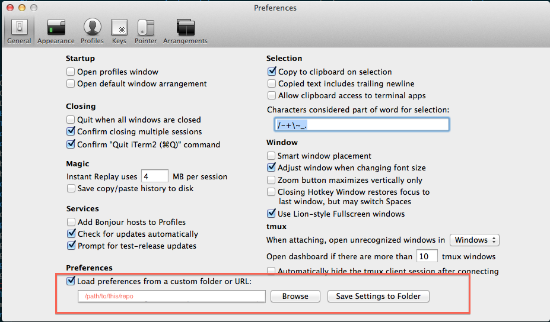

instasetup
==========

Shell script that will download, install, and setup my environment

For now this is meant for OSX

### Step 1  

after downloading/cloning this repo, run the install shell script
```shell
cd /path/to/repo/
./install.sh 
```
if you get an error then you might have to give it the ability to execute first:  
```chmod +x install.sh```   
then try ```./install.sh``` again

### Step 2  
Start iTerm2 and set the preference to use this repo's settings .plist file  
**iTerm > Preferences > General**



